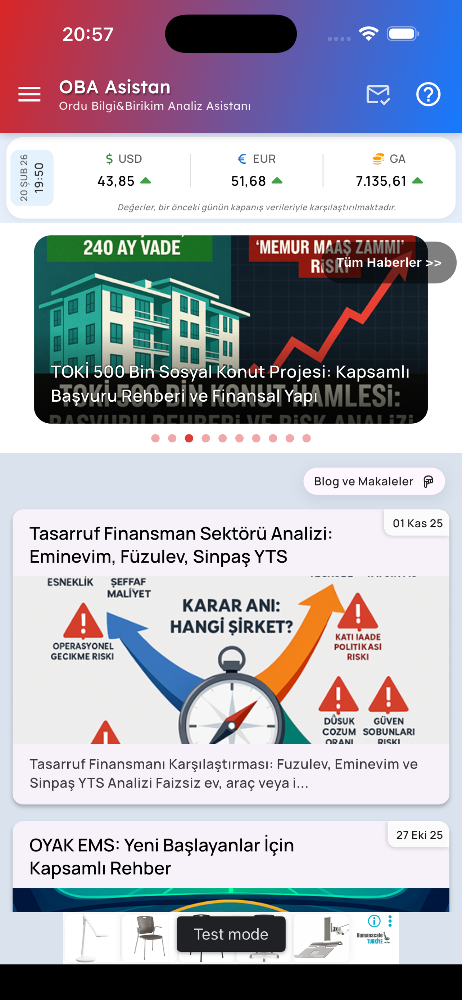
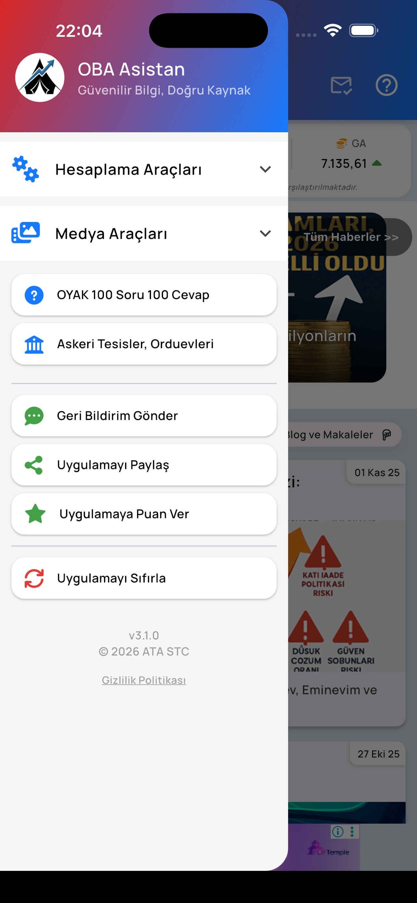
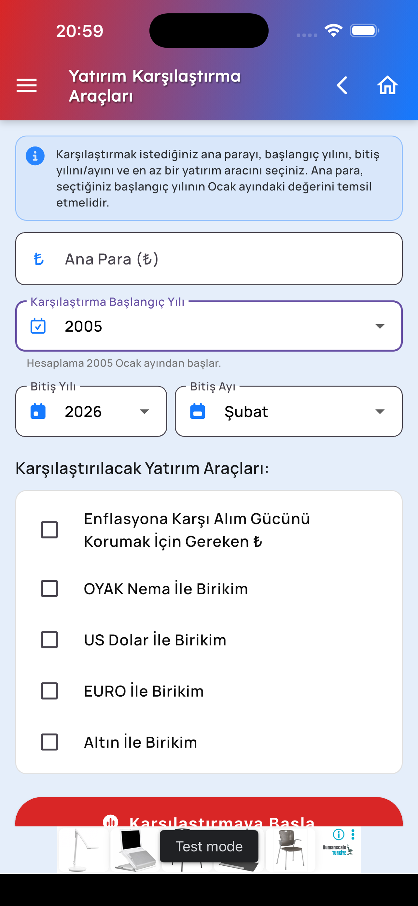
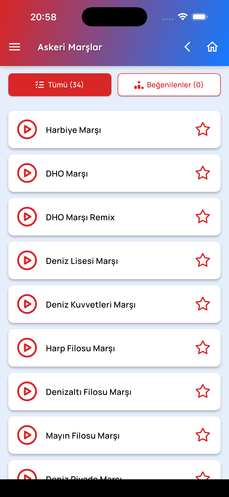
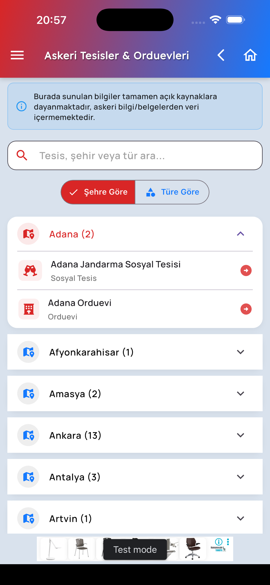
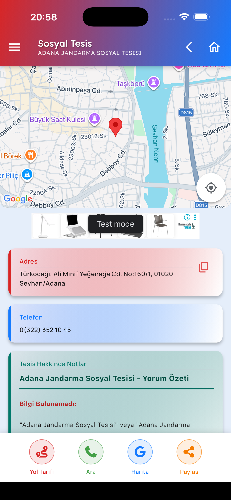
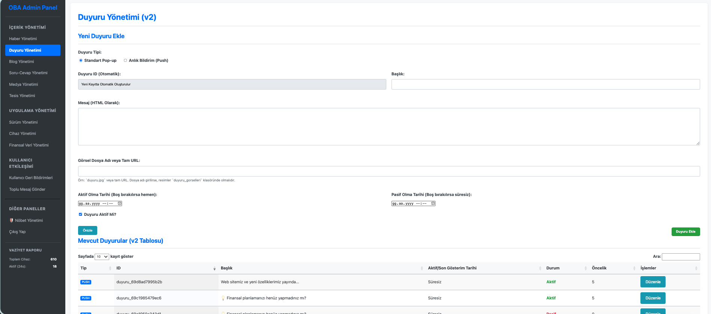

# OBA Platform — Public Showcase

**EN** | [Türkçe aşağıda](#türkçe)

---

## English

### What this is

A **marketing and technical overview** of a full-stack member platform: **iOS & Android** (Flutter), **PHP REST-style API**, **MySQL**, **web admin**, **FCM push notifications**, and a **static public website** (HTML/CSS/JS with a server-side API bridge).  
This repository contains **documentation and diagrams only**. It does **not** include application source code, secrets, or proprietary calculation implementations.

### Live reference (public web)

The static **visitor-facing** site is publicly available at **https://oba.atastc.com** (content and branding are deployment-specific).

### Mobile app store links

- App Store (iOS): https://apps.apple.com/us/app/oba-asistan/id6759215693
- Play Store (Android): https://play.google.com/store/apps/details?id=com.appsorcerer.moyak

### Admin panel

There is **no public demo URL or credentials** in this repo. **Screenshots** illustrate the admin experience. For qualified inquiries, a **separate demo** (link + access) may be provided **on request** — never committed here.

### Calculation tools (mobile)

Described at a **high level only** (purpose and categories). **No source code** is published in this showcase. See [docs/CALCULATION_TOOLS.md](docs/CALCULATION_TOOLS.md).

### Architecture

See [docs/ARCHITECTURE.md](docs/ARCHITECTURE.md).

### Capabilities (sanitized)

See [docs/CAPABILITIES_OVERVIEW.md](docs/CAPABILITIES_OVERVIEW.md).

### White-label / deployment

See [docs/WHITE_LABEL_CHECKLIST.md](docs/WHITE_LABEL_CHECKLIST.md).

### Commercial models

See [docs/COMMERCIAL.md](docs/COMMERCIAL.md).

### Security notice

This repo must remain **free of** API keys, Firebase service accounts, keystores, database passwords, and real client data. If you notice sensitive material here, please report it responsibly to the repository owner.

---

## Türkçe

### Bu depo nedir?

Üye odaklı **uçtan uca platform** tanıtımı: **iOS ve Android** (Flutter), **PHP API**, **MySQL**, **web yönetim paneli**, **FCM bildirimleri** ve **statik kamu web sitesi** (HTML/CSS/JS + sunucu tarafı köprü).  
Burada yalnızca **dokümantasyon ve şemalar** vardır; **uygulama kaynak kodu**, **gizli anahtarlar** ve **hesaplama algoritması kaynağı** paylaşılmaz.

### Canlı referans (ziyaretçi web)

Statik **herkese açık** site: **https://oba.atastc.com** (içerik ve marka kuruluma göre değişir).

### Mobil mağaza bağlantıları

- App Store (iOS): https://apps.apple.com/us/app/oba-asistan/id6759215693
- Play Store (Android): https://play.google.com/store/apps/details?id=com.appsorcerer.moyak

### Yönetim paneli

Bu repoda **canlı demo adresi veya giriş bilgisi yoktur**. Yönetim deneyimi **ekran görüntüleri** ile anlatılır. Uygun taleplerde **ayrı demo** (link + erişim) **talep üzerine** verilebilir; buraya asla yazılmaz.

### Mobil hesaplama araçları

Yalnızca **özet düzeyde** (ne işe yarar, hangi başlıklar). **Kaynak kod yoktur.** Bkz. [docs/CALCULATION_TOOLS.md](docs/CALCULATION_TOOLS.md).

### Mimari

Bkz. [docs/ARCHITECTURE.md](docs/ARCHITECTURE.md).

### White-label / kurulum

Bkz. [docs/WHITE_LABEL_CHECKLIST.md](docs/WHITE_LABEL_CHECKLIST.md).

### Ticari modeller

Bkz. [docs/COMMERCIAL.md](docs/COMMERCIAL.md).

### Güvenlik

API anahtarları, Firebase servis hesabı, keystore, veritabanı şifresi ve gerçek müşteri verisi bu repoda **bulunmamalıdır**.  
Yayın kapsamı ve güvenlik sınırları için bkz. [docs/SECURITY_SCOPE_MATRIX.md](docs/SECURITY_SCOPE_MATRIX.md).

---

## Screenshots / Ekran görüntüleri

Sanitised captures only — no credentials. **EN:** illustrative product views. **TR:** anonimleştirilmiş ürün görünümleri.  
File list and policy: [docs/SCREENSHOTS.md](docs/SCREENSHOTS.md).

**EN:** Mobile — main · **TR:** Mobil — ana ekran

**EN:** Mobile — sidebar · **TR:** Mobil — yan menü

**EN:** Mobile — calculation tools · **TR:** Mobil — hesaplama araçları

**EN:** Mobile — music player · **TR:** Mobil — müzik çalar

**EN:** Mobile — places (filter) · **TR:** Mobil — yerler (filtre)

**EN:** Mobile — places (detail) · **TR:** Mobil — yerler (detay)

**EN:** Mobile — Q&A · **TR:** Mobil — soru-cevap

**EN:** Web — admin panel (illustrative) · **TR:** Web — yönetim paneli (örnek)

---

© Showcase materials. Product and branding may be licensed separately.
