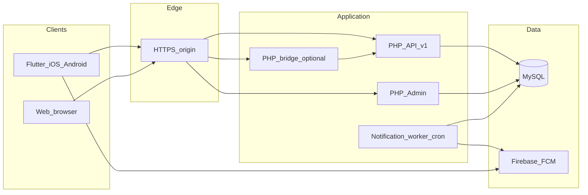

# Architecture overview

**EN** (Turkish summary at bottom)

## Components

| Layer | Role |
|--------|------|
| Mobile apps | Flutter clients; central API configuration; FCM for push; deep links by notification type (news, announcement, blog). |
| API | PHP under `/api/v1/`; JSON endpoints; device registration; content feeds. |
| Database | MySQL; content tables; device table with optional test-device flag; notification job queue. |
| Admin | PHP panel for news, blog, announcements, devices; enqueues FCM jobs with audience targeting. |
| Worker | Single PHP cron worker processes `notification_jobs` and sends via Firebase HTTP v1. |
| Static web | HTML/CSS/JS; optional PHP bridge so the browser never holds private API keys. |

## High-level diagram

## Notification flow (conceptual)

1. Editor publishes content in admin and optionally enqueues a push job with target **all devices** or **test devices only**.
2. Cron runs `notification_worker.php`; job includes `job_type` and content id in FCM data payload.
3. App opens the correct detail screen from payload (`type` + id fields).

## URLs (placeholders for buyer deployments)

- API: `https://example.com/api/v1/`
- Admin: `https://example.com/admin/`
- Public web: `https://example.com/`

---

## Türkçe özet

- **Mobil:** Flutter; merkezi API; FCM; bildirimde içerik türüne göre detay ekranı.
- **API / admin / worker:** PHP; MySQL; kuyruk tablosu ile tek worker cron.
- **Web:** Statik site; tarayıcıda gizli anahtar yok; gerekirse sunucuda `bridge` ile API.

Alıcı kurulumunda tüm URL’ler kendi domain’i ile değiştirilir.
