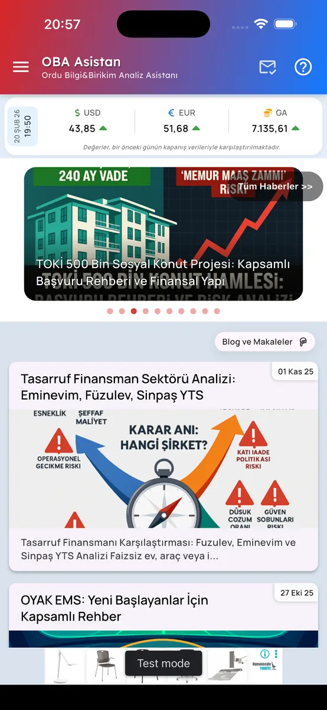

# Screenshots

## Policy

- **No** real user data, **no** production credentials in images.
- Admin UI: **screenshots only** in public materials; live demo is **on request** with separate credentials (not stored in git).
- Mobile store links are the primary public install reference; screenshots support the story only.

## Format

- Files are **WebP** for smaller size and faster GitHub rendering.
- Long edge is capped at **1200px** while keeping aspect ratio (exported from original PNGs).

## Current files (`assets/screenshots/`)

| File | Description (EN) |
|------|--------------------|
| `mobile-main.webp` | Mobile home / main navigation |
| `mobile-sidebar.webp` | Sidebar / menu |
| `mobile-calculationtools.webp` | Calculation tools area (generic) |
| `mobile-music-player.webp` | In-app music player |
| `mobile-places-filter-selection.webp` | Places module — filter selection |
| `mobile-places-info-actions.webp` | Places module — detail / actions |
| `mobile-qa.webp` | Q&A style screen (renamed from `mobile-q&a` for simpler paths) |
| `web-admin-panel.webp` | Web admin panel (illustrative; blur sensitive fields before publishing updates) |

## Markdown embed (examples)

```markdown

```

---

## Türkçe

## Kurallar

- Görsellerde **gerçek kullanıcı verisi** ve **canlı şifre** olmasın.
- Admin için public repoda yalnızca **ekran görüntüsü**; canlı demo **ayrı talep**.
- Mağaza linkleri kurulum için ana referans; görseller destekleyicidir.

## Biçim

- Dosyalar daha küçük boyut ve hızlı görüntüleme için **WebP**.
- En uzun kenar **1200px** ile sınırlandırıldı; en-boy oranı korunur (kaynak PNG’lerden üretildi).

## Mevcut dosyalar (`assets/screenshots/`)

| Dosya | Açıklama (TR) |
|-------|----------------|
| `mobile-main.webp` | Mobil ana ekran / gezinme |
| `mobile-sidebar.webp` | Yan menü |
| `mobile-calculationtools.webp` | Hesaplama araçları alanı (genel) |
| `mobile-music-player.webp` | Uygulama içi müzik çalar |
| `mobile-places-filter-selection.webp` | Yerler modülü — filtre seçimi |
| `mobile-places-info-actions.webp` | Yerler modülü — detay / aksiyonlar |
| `mobile-qa.webp` | Soru-cevap tarzı ekran (yol sadeleştirmesi için yeniden adlandırıldı) |
| `web-admin-panel.webp` | Web yönetim paneli (örnek; güncellemeden önce hassas alanları bulanıklaştırın) |

## Markdown gömme (örnek)

```markdown

```
